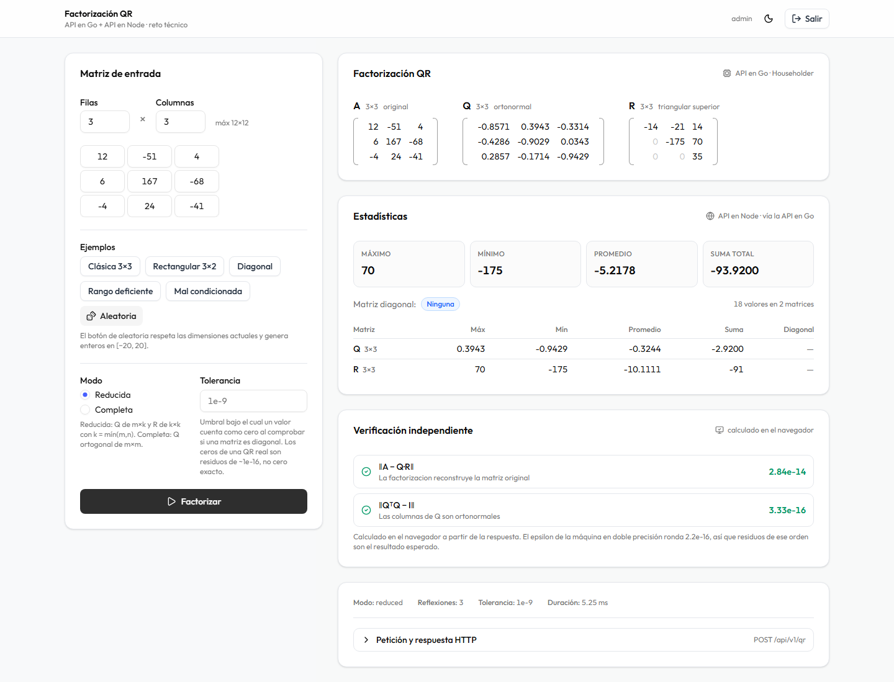

# Frontend (React 19 + Vite + shadcn/ui)

Interfaz que consume el sistema: introduce una matriz, la factoriza y muestra
Q, R, las estadísticas y una **verificación matemática independiente**.

> **Documentación detallada:** [`docs/frontend.md`](docs/frontend.md)
> — los flujos paso a paso, la verificación en el navegador, el manejo de
> sesión, los componentes y la presentación de números.



---

## Arranque

```bash
pnpm install
pnpm dev
```

→ **http://localhost:5173** · usuario `admin` · contraseña `Reto2026.Demo`

**No hace falta crear ningun `.env`**: el valor por defecto ya apunta a
`http://localhost:8080`, que es donde escucha el backend.

Requiere el backend en marcha. Vive en **otro repositorio**, y arrancarlo es un
solo comando —genera sus propias claves y no necesita mas que Docker:

```bash
git clone https://github.com/ProDevelop123/reto-2026.git
cd reto-2026
docker compose up -d --build
```

El puerto **5173 es fijo** (`strictPort`): es el origen que la API declara en
`CORS_ORIGINS`. Si Vite eligiera otro al estar ocupado, el navegador bloquearía
las peticiones y el fallo sería difícil de diagnosticar.

## Gestor de paquetes

El proyecto usa **pnpm**, con la versión fijada en `package.json`:

```json
"packageManager": "pnpm@10.6.2"
```

Fijarla no es cosmético. Vercel lee ese campo y usa corepack para instalar esa
versión concreta en lugar de la que traiga por defecto su imagen de
construcción. Es lo que evita el fallo `ERR_INVALID_THIS`
—*"Value of `this` must be of type URLSearchParams"*— que producen las
versiones 8.x y 9.0–9.1 de pnpm sobre Node 20 o superior: usan un polyfill de
`fetch` incompatible con el `undici` de Node moderno y fallan al consultar el
registro.

Además garantiza que la construcción local y la de Vercel usen **exactamente el
mismo gestor**, que es lo que hace reproducible el resultado.

Si no tienes pnpm:

```bash
corepack enable          # viene con Node 16.9+
```

## Comandos

```bash
pnpm dev       # desarrollo con recarga en caliente
pnpm build     # compilación de producción
pnpm preview   # sirve la compilación
pnpm lint      # análisis estático
```

## Las tres ideas

**1. La primera factorización cuesta un clic.** Al entrar ya hay una matriz
cargada, más cinco ejemplos que demuestran cada uno una propiedad concreta del
backend: la clásica de los libros, una rectangular, una diagonal, una de rango
deficiente y la de Läuchli, donde se ve que Householder conserva la
ortogonalidad allí donde Gram-Schmidt la pierde.

**2. El navegador verifica al backend.** El panel de verificación no muestra
datos de la API: recalcula `Q·R` y `QᵀQ` en JavaScript y mide los residuos. La
corrección del algoritmo deja de ser una afirmación del servidor.

**3. Cada resultado dice de dónde viene.** Las matrices llevan la etiqueta *API
en Go*, las estadísticas *API en Node*, y los residuos *calculado en el
navegador*. Documenta la arquitectura visualmente.

## Estructura

```
src/
├─ app/            router (3 rutas) + layouts
├─ features/
│  ├─ auth/        login, store, TokenService, aviso de caducidad
│  └─ matrix/      grid, resultados, verificación, payload
├─ shared/lib/     cliente HTTP y formato
└─ components/ui/  shadcn
```

Tres features, frente a las 33 del sistema de diseño del que se reutilizan los
componentes.

## Variables de entorno

| Variable | Por defecto | Descripción |
|---|---|---|
| `VITE_API_URL` | `http://localhost:8080` | URL base de la API en Go |

Solo hay una: el frontend **nunca habla con la API de Node**, que no está
expuesta. Su resultado ya viene en la respuesta de Go.
